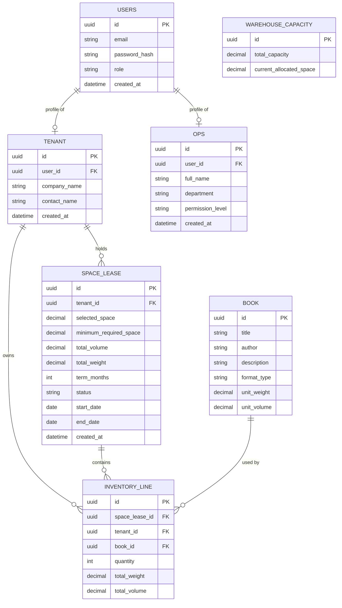

# Entity Relationship Diagram

## App ownership
 
| App | Tables |
|---|---|
| `users` | `USERS`, `TENANT`, `OPS` |
| `inventory` | `BOOK_FORMAT`, `INVENTORY_LINE` |
| `lease` | `SPACE_LEASE` |
| `capacity` | `WAREHOUSE_CAPACITY` |